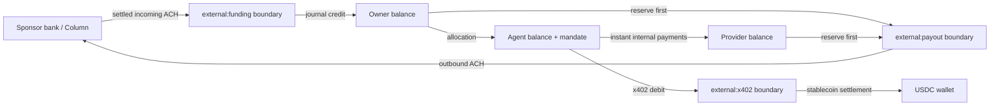

# Treasury boundary

Version 0.10 connects the closed-loop ledger to real bank and stablecoin asset
observations. It implements the software boundary for incoming ACH funding,
ACH payouts, provider-event recovery, funding returns, exposure freezes, and
continuous reconciliation. It does **not** by itself authorize a launch with
customer money.

## Economic model

The internal ledger remains the hot path. Agent-to-agent and agent-to-API
payments are local, atomic micro-dollar transfers. External providers operate
only at the perimeter:



`money.ledger_entries` remains the immutable accounting source of truth.
Provider objects are evidence for narrowly defined boundary commands; they are
never treated as the ledger.

## Processes and credentials

Each process must use a login inheriting exactly one database role:

| Process | Role | Can do | Cannot do |
|---|---|---|---|
| Product API | `money_app` | Request/cancel an account-scoped payout; read scoped treasury state | Verify destinations, settle funding, submit ACH, read treasury tables |
| Webhook ingress | `money_treasury_ingress` | Enqueue one HMAC-authenticated provider event envelope | Read balances/events or move money |
| Event worker | `money_treasury_worker` | Authenticated event re-fetch; apply exact transitions; trip breakers on event-recovery failure | Register routes, release freezes, reopen breakers, submit outbound ACH |
| Payout worker | `money_payout_worker` | Claim reserved payouts; record provider submission/failure/manual review | Credit funding, view arbitrary accounts, reopen breakers |
| Reconciler | `money_reconciler` | Record read-only asset observations; inspect health; trip breakers | Move money or reopen breakers |
| Treasury admin | `money_treasury` | Register verified references; resolve reviewed payouts; configure controls; release reviewed freezes | Process provider events or submit ACH |
| Operations | `money_ops` | Read accounting/treasury evidence and health | Move money |

The webhook secret belongs only in ingress. Event reads, payout origination,
and bank reconciliation use separately rotatable Column keys; never inject the
payout key into ingress, the event worker, the reconciler, or the product API.
Stablecoin reconciliation has RPC URLs and public addresses only—never a
signing key.

## Incoming funding

1. Column sends a JSON event to `POST /webhooks/column`.
2. Ingress checks `Webhook-Endpoint-Id` and the `Column-Signature` HMAC over the
   exact, untouched request bytes.
3. Ingress stores only provider, event ID, endpoint ID, and delivery hash, then
   returns `202`.
4. The event worker fetches `/events/{event_id}` with Column Basic auth, then
   fetches the referenced ACH object independently.
5. Immutable fields—transfer ID, amount, currency, direction, type, bank
   account, account number, and counterparty—must agree.
6. Only an incoming USD `CREDIT` with an authenticated historical
   `ach.incoming_transfer.settled` event can credit a mapped deposit route.

Event data determines historical state because Column does not guarantee
webhook order. The current transfer is an additional immutable-term check, not
part of the persisted event hash, so a crash/retry remains stable after the
provider object advances.

After 25 failed attempts, or a permanent evidence mismatch, an event becomes
`dead` and trips every breaker. Once the provider/parser issue has been
investigated, treasury administration can either retry it from attempt zero or
ignore a proven non-economic event. The original error and reviewed decision
remain append-only, and controls stay disabled:

```powershell
npm run treasury:setup -- resolve-event <inbox-id> retry INC-200 "adapter fix deployed"
npm run treasury:setup -- resolve-event <inbox-id> ignore INC-201 "verified non-economic test event"
```

Deposit routes are created by treasury operations only:

```powershell
npm run treasury:setup -- deposit-route usr_... acno_... "Primary USD"
```

The account-number reference is never exposed by owner APIs; owners see only a
route ID, provider, label, and status.

## Returns and exposure

An authenticated incoming ACH return reverses the **exact original amount**
from the owner to `external:funding`, even when the owner has already allocated
or spent it. This may make the owner balance negative. The system then:

- records the exact unrecovered exposure;
- freezes the owner and every active agent/provider owned by that owner;
- blocks those identities at signed-request authentication;
- applies later incoming funding against oldest open exposure first;
- keeps the family frozen after economic recovery until an operator reviews
  and explicitly releases it.

```powershell
npm run treasury:setup -- release-freeze usr_... "return recovered; review case RISK-123"
```

Exposure above the configured global maximum trips funding, payout, and x402
breakers. A freeze cannot be released while the USD balance is negative or any
exposure remains open.

## Payouts

Payout destinations are opaque provider counterparty IDs verified by treasury
operations after the required identity and bank-account checks:

```powershell
npm run treasury:setup -- destination usr_... ctpy_... "Owner checking"
npm run treasury:setup -- destination prv_... ctpy_... "Merchant operating"
```

Raw routing/account numbers do not enter the product API or ledger database.
Owners call `POST /owner/payouts`; providers sign `POST /provider/payouts` with
their own key. Both supply `destinationId`, whole-cent `amountMicros`, and an
idempotency key.

The request transaction atomically moves source funds to `external:payout`
before a worker can see it. A worker claims rows with `FOR UPDATE SKIP LOCKED`,
commits, and only then calls Column. Column receives
`Idempotency-Key: money-payout-{payout_uuid}`.

Outcomes are deliberately distinct:

- accepted: record Column transfer ID and normalized state;
- definitive `400`/`404`/`422` rejection: reverse the exact reserve and mark
  failed;
- retryable timeout/`409`/`429`/5xx: release the lease and retry with the same
  provider key;
- malformed success, auth failure, invariant mismatch, or an unknown outcome
  older than 29 days: retain the reserve, mark `manual_review`, and trip every
  breaker.

Only a never-attempted queued payout can be cancelled by its source. Provider
`failed`, `returned`, or `cancelled` events cause one exact idempotent reversal.

An ambiguous payout stays reserved until treasury operations verify it in
Column. The reviewed resolution is append-only and requires an incident/change
reference. Attach a confirmed transfer, or reverse a definitively absent or
terminal transfer, with the admin-only command:

```powershell
npm run treasury:setup -- resolve-payout <payout-uuid> submitted acht_... INC-123 "Column confirmed submission"
npm run treasury:setup -- resolve-payout <payout-uuid> failed - INC-124 "Column confirmed no transfer was created"
```

Resolution deliberately leaves all breakers open. Reconcile assets, complete
the two-person review, and only then restore controls separately.

## Reconciliation and breakers

Register each external asset-holding account before starting reconciliation:

```powershell
npm run treasury:setup -- asset-account column bacc_... USD bank
npm run treasury:setup -- asset-account evm-base 0xWallet... USD stablecoin
```

Column book value is `available + holding + locked` in cents, converted to
micro-dollars; pending is retained separately. The EVM source performs a
read-only ERC-20 `balanceOf` at a recorded block and currently supports
six-decimal USD stablecoins.

Expected external assets come from the external-boundary journal balances.
Queued/submitting/submitted/manual-review payouts and pending x402 settlements
form an uncertainty interval. All configured sources need a fresh observation
within five minutes. A complete fresh snapshot outside configured tolerance
atomically disables funding, payouts, and new x402 activation.

Migration `0007` starts all three controls disabled. Register the external
asset accounts, run reconciliation to a clean result, review `/ops/treasury`,
and explicitly restore controls before accepting funding or external outflow.
This makes a new deployment and a live upgrade fail closed if the reconciler
or its credentials are missing.

`GET /ops/treasury` (bearer-token protected) returns reconciliation values,
control state, dead-event/manual-review counts, and payouts blocked by disabled
destinations. It returns `503` if no asset source is configured, any breaker is
open, any asset is outside tolerance, a provider event is dead, or a payout
needs intervention. Only `money_treasury` can reopen controls, and
that should follow a two-person incident review in production.

Every automatic trip and administrative configuration is appended to
`money.treasury_control_events` with the database login, resulting limits, and
reason. Restoring controls preserves the reviewed limits and records the
incident/change reference:

```powershell
npm run treasury:setup -- restore-controls "INC-123 approved by reviewer-a and reviewer-b"
```

## Running the services

Apply migrations and `db/roles.sql`, create separate logins for the roles
above, then configure `.env.example` through a secret manager:

```powershell
npm run treasury:webhooks
npm run treasury:events
npm run treasury:payouts
npm run treasury:reconcile
npm run ops:db
```

Terminate public TLS before webhook ingress. Restrict Column API egress and,
where available, Column API-key IP ranges. Alert on any breaker transition,
dead event, manual-review payout, negative customer balance, stale snapshot,
reconciliation variance, repeated provider authentication error, or worker
lease expiry.

## Provider contract used

The adapter follows Column's documented contracts for [Basic authentication](https://docs.column.com/working-with-the-api/authentication/),
[raw-body webhook HMAC, retries, and unordered events](https://docs.column.com/working-with-the-api/events-and-webhooks/),
[ACH creation](https://docs.column.com/api/ach-transfer/create-an-ach-transfer/),
[ACH lifecycle fields](https://docs.column.com/api/ach-transfer/ach-transfer-object/),
and [bank-account balances](https://docs.column.com/api/bank-account/bank-account-object/).
Column may evolve fields and events; pin sandbox contract tests before a live
API version or behavior change.

## Launch blockers outside this repository

Before customer funds, the company still needs at minimum:

- an executed sponsor-bank/FBO and Column program approved for the use case;
- counsel-led money-transmission and state/federal regulatory analysis;
- KYC/KYB, beneficial-owner, sanctions/PEP, transaction monitoring, case
  management, SAR/escalation, record-retention, and complaint programs;
- account ownership verification and controlled payout-destination changes;
- fraud models, velocity/risk limits, reserves, return-loss allocation, and
  documented write-off authority;
- safeguarding, bankruptcy-remoteness, daily bank-to-subledger reports, and
  independent finance reconciliation;
- key/HSM, secrets, network, backup, disaster-recovery, penetration-test,
  vendor-risk, and incident-response controls;
- customer agreements, disclosures, support operations, disputes, tax
  reporting, and privacy/data-governance processes.

Those are product requirements, not paperwork to defer after launch.
